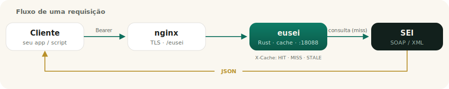
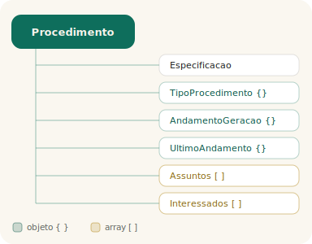

<p align="center">
  
</p>

<p align="center">
  <strong>API HTTP/JSON (Rust + axum) para os Web Services do SEI.</strong><br/>
  Consultas read-only de processos, documentos e andamentos — em JSON limpo.
</p>

<p align="center">
  
  
  
</p>

<p align="center">
  
</p>

A **eusei** traduz os Web Services SOAP do SEI (Sistema Eletrônico de Informações)
em JSON. Roda no servidor **servidor** — o único com acesso liberado ao SEI pelo
firewall institucional — e espelha as consultas do pacote R
[`rsei`](https://github.com/StrategicProjects/rsei). Publicada em
`https://SEU-DOMINIO/eusei/`.

Veja [`PLAN.md`](PLAN.md) para a arquitetura e o roadmap.

## Destaques

- **Read-only completo**: processos, documentos, publicações, blocos, andamentos e 15 listas auxiliares.
- **Auto-contido**: um binário único serve a API, a landing (Tailwind v4) e a documentação — sem CDN.
- **Falha graciosa**: erros com `codigo` estável e mensagens claras (incl. “SEI indisponível”).
- **Seguro**: Bearer token; a chave do SEI nunca é exposta ao cliente.

## Desenvolvimento

Só o servidor fala com o SEI e compila o binário Linux de destino. Ciclo:

```sh
# 1. editar local (mac)
# 2. sincronizar para o servidor
rsync -az --delete --exclude target --exclude .git ./ servidor:~/eusei_dev/
# 3. no servidor
ssh servidor 'cd ~/eusei_dev && ~/.cargo/bin/cargo build && cp .env.example .env && ~/.cargo/bin/cargo run'
```

## Configuração

Veja [`.env.example`](.env.example). Em produção, as variáveis vêm de
`/etc/eusei.env` via systemd. A chave de acesso do SEI
(`SEI_IDENTIFICACAO_SERVICO`) fica só no servidor e nunca é exposta ao cliente.

> **Funciona com qualquer instância do SEI.** O endpoint, a sigla e a chave são
> 100% configuráveis (`SEI_URL`, `SEI_SIGLA_SISTEMA`, `SEI_IDENTIFICACAO_SERVICO`,
> `SEI_ID_UNIDADE` e `SEI_SIP_*`). Os defaults apontam para o SEI de Pernambuco,
> mas o envelope SOAP e as operações são padrão do SEI — basta apontar `SEI_URL`
> para outra instalação. Nada de específico do PE está embutido no código.

## Autenticação

Todas as rotas (exceto `/health`) exigem `Authorization: Bearer <token>`, validado
contra `EUSEI_TOKENS`.

## Uso

Base pública: `https://SEU-DOMINIO/eusei/`.

> **Importante:** consulte processo/documento/bloco pela **query string**
> (`?protocolo=...`), não pelo path. A barra (`/`) do número do processo não
> sobrevive como `%2F` no path através do nginx; na query ela passa intacta.

```sh
# consultar um processo (forma recomendada)
curl -H 'Authorization: Bearer SEU-TOKEN' \
  'https://SEU-DOMINIO/eusei/v1/procedimento?protocolo=0011108545.000056/2022-49'

# listas
curl -H 'Authorization: Bearer SEU-TOKEN' \
  'https://SEU-DOMINIO/eusei/v1/paises'
```

### Endpoints

| Rota | Descrição |
|------|-----------|
| `GET /health` | liveness (sem auth) |
| `GET /v1/procedimento?protocolo=` | consulta um processo (flags `sin_retornar_*` opcionais) |
| `GET /v1/procedimentos?protocolos=A,B` | lote (cada item com `dados`/`erro`) |
| `GET /v1/procedimento-individual?...` | processo individual mais recente |
| `GET /v1/documento?protocolo=` | consulta um documento |
| `GET /v1/publicacao?...` | consulta publicação (id_publicacao/id_documento/protocolo_documento) |
| `GET /v1/bloco?id=` | consulta um bloco |
| `GET /v1/{paises,estados,cidades,unidades,series,tipos-procedimento,...}` | listas read-only |

As variantes com path (`/v1/procedimento/{protocolo}`) existem para uso interno
(`127.0.0.1:18088`), onde o `%2F` é preservado.

### Formato da resposta

Sucesso devolve `{ ok, dados }`, com os nomes originais do SEI (`xsi:nil` → `null`,
arrays como listas JSON). Abaixo, a estrutura de um processo:

<p align="center">
  
</p>

### Erros (falha graciosa)

Erros vêm como JSON `{ "ok": false, "codigo", "erro", "detalhe" }` com o status
HTTP apropriado. O campo `codigo` é estável para tratamento pelo cliente:

| `codigo` | HTTP | Quando |
|----------|------|--------|
| `nao_autorizado` | 401 | token ausente/inválido |
| `parametro_invalido` | 400 | falta um parâmetro obrigatório |
| `sei_fault` | 400 | o SEI rejeitou (ex.: processo inexistente) — `erro` traz a mensagem do SEI |
| `sei_indisponivel` | 503 | **SEI fora do ar / sem conexão** (após 1 retentativa) |
| `sei_timeout` | 504 | o SEI demorou demais |
| `sei_erro_http` | 502 | o SEI respondeu HTTP de erro |
| `resposta_invalida` | 502 | resposta do SEI não pôde ser interpretada |

Exemplo (SEI fora do ar):

```json
{ "ok": false, "codigo": "sei_indisponivel",
  "erro": "O SEI está temporariamente indisponível. Não foi possível conectar ao servidor do SEI; tente novamente em alguns minutos.",
  "detalhe": null }
```

## Frontend

- **Landing**: `https://SEU-DOMINIO/eusei/` — página inicial em
  **Tailwind CSS v4** (CSS gerado/tree-shaken e embutido no binário, sem CDN), com
  hero, início rápido e cards de endpoints.
- **Referência**: `…/eusei/__docs__` — documentação custom em Tailwind v4
  (cards por endpoint, diagramas SVG de fluxo e da resposta, navegação lateral).

Tudo é servido pelo próprio binário (Tailwind e fontes vendorizados, sem
dependência de rede externa). O CSS do Tailwind (cobre `index.html` e `docs.html`)
é regenerado com:

```sh
cd /tmp && npm i tailwindcss @tailwindcss/cli && \
  cp <repo>/static/{tw-input.css,index.html} . && \
  npx @tailwindcss/cli -i tw-input.css -o tailwind.css --minify && \
  cp tailwind.css <repo>/static/tailwind.css
```
